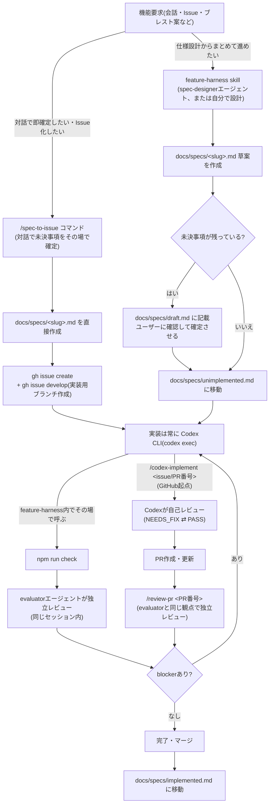
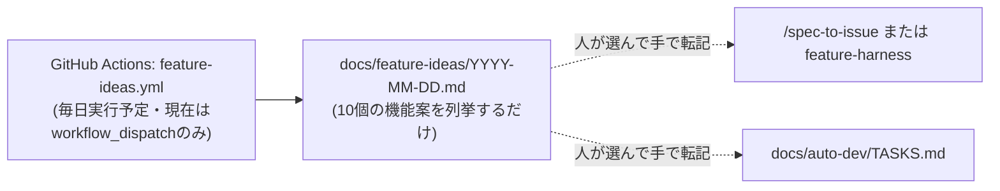
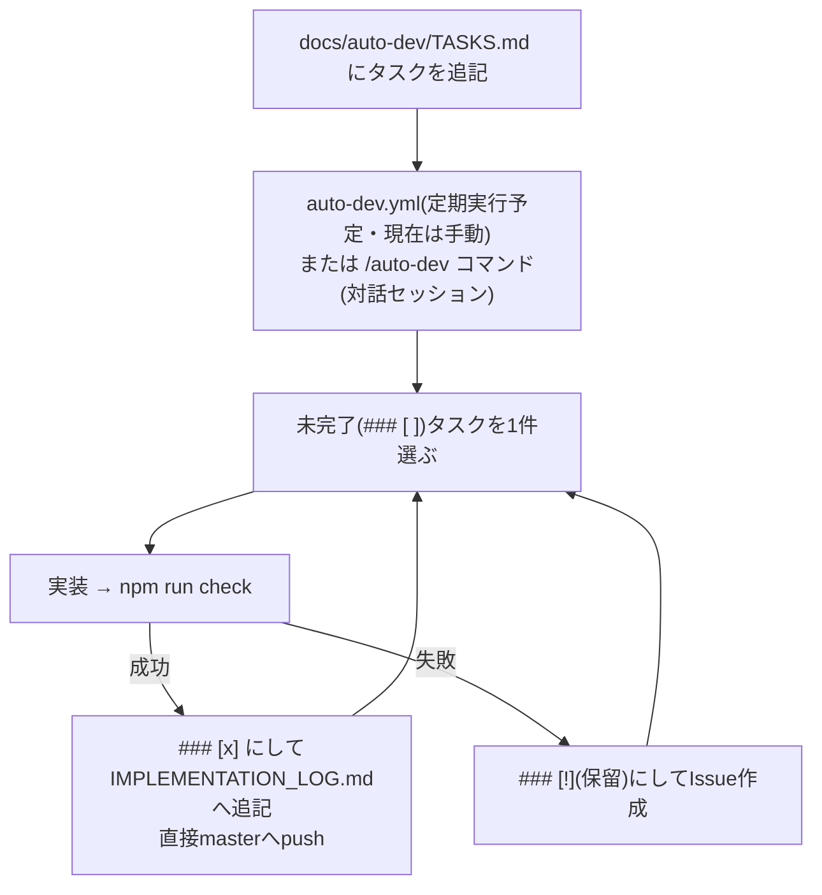

# 開発フロー全体像

このリポジトリでの開発には、独立した3つの経路がある。以前あった「大規模パイプライン」
(discover→spec-draft→final-spec→implement→codex-review→claude-review→evaluateの7段)は
削除済みで、現在は下記の3経路に統一されている。

## ① 仕様ベースの開発(メインフロー)

**ポイント**: 仕様書の入口は2つ(`/spec-to-issue`=対話で即確定、`feature-harness`=未決事項を残せる)だが、
実装は必ずCodex CLI、評価は必ず独立したレビュー(evaluatorエージェントまたは`/review-pr`)という
1本の流れに合流する。仕様書の状態は `docs/specs/draft.md → unimplemented.md → implemented.md`
の3ファイルで追跡する(詳細は [docs/specs/README.md](specs/README.md))。

## ② 機能案のブレスト(実装には繋がらない)

**ポイント**: ここは純粋なアイデア出しで、自動では①③のどちらにも繋がらない。気になる案があれば
人が手で転記する(詳細は [docs/feature-ideas/README.md](feature-ideas/README.md))。

## ③ タスクリスト駆動のauto-dev(仕様書を経由しない別経路)

**ポイント**: ①とは完全に別経路。`docs/specs/` を経由せず、タスクを直接実装してmasterへpushする
(PR・レビューのステップが無い)。小さな改善・雑務向け。

## 全体の使い分け

| 状況 | 使うもの |
| --- | --- |
| 新機能を仕様からきちんと作りたい | ①(`/spec-to-issue` か `feature-harness`) |
| ネタが無くてアイデアだけ欲しい | ②(毎日の機能案ブレスト。手で①か③に転記) |
| 小さな雑務・改善を溜めて流したい | ③(`docs/auto-dev/TASKS.md`) |
| 既存PRをレビューしたい | `/review-pr <PR番号>` |
| 既存Issue/PRを実装・修正したい | `/codex-implement <issue/PR番号>` |
