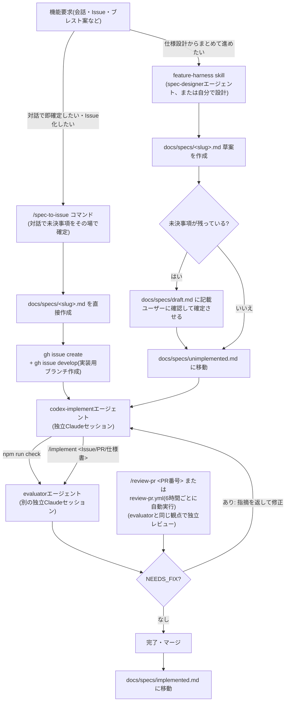
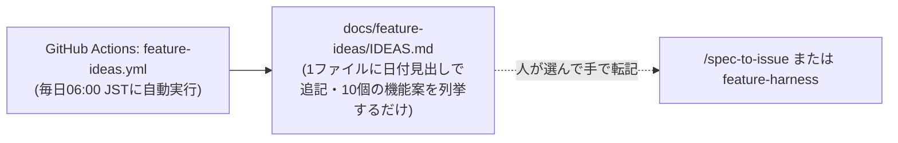

# 開発フロー全体像

このリポジトリでの開発には、独立した2つの経路がある。以前あった「大規模パイプライン」
(discover→spec-draft→final-spec→implement→codex-review→claude-review→evaluateの7段)と
タスクリスト駆動の「auto-dev」は削除済みで、現在は下記の2経路に統一されている。

## ① 仕様ベースの開発(メインフロー)

**ポイント**: 仕様書の入口は2つ(`/spec-to-issue`=対話で即確定、`feature-harness`=未決事項を残せる)だが、
実装・評価は `/implement` が別々のClaudeセッションを起動し、評価が `PASS` になるまで修正ループを回す。
利用者はオーケストレーターのコマンドだけを実行する。仕様書の状態は `docs/specs/draft.md → unimplemented.md → implemented.md`
の3ファイルで追跡する(詳細は [docs/specs/README.md](specs/README.md))。
PRレビューは `review-pr.yml` が6時間ごとに全openPR(Dependabot含む)を自動レビューし、
blockerが無ければ自動マージする。何を確認してマージしたかは [docs/review-pr/LOG.md](review-pr/LOG.md)
に記録される(ヘッドレス実行でその場のユーザー確認が無いための事後追跡用)。

## ② 機能案のブレスト(実装には繋がらない)

**ポイント**: ここは純粋なアイデア出しで、自動では①に繋がらない。気になる案があれば
人が手で`/spec-to-issue`か`feature-harness`に転記する(詳細は [docs/feature-ideas/README.md](feature-ideas/README.md))。

## 全体の使い分け

| 状況 | 使うもの |
| --- | --- |
| 新機能を仕様からきちんと作りたい | ①(`/spec-to-issue` か `feature-harness`) |
| ネタが無くてアイデアだけ欲しい | ②(毎日の機能案ブレスト。手で①に転記) |
| 既存PRをレビューしたい(今すぐ・手動) | `/review-pr <PR番号>` |
| 既存PRのレビュー・自動マージ(定期実行) | `review-pr.yml`(6時間ごと。手動実行は `workflow_dispatch`) |
| Issue/PR・仕様書・実装依頼を実装・修正したい | `/implement <Issue/PR番号・仕様書パス>` |
